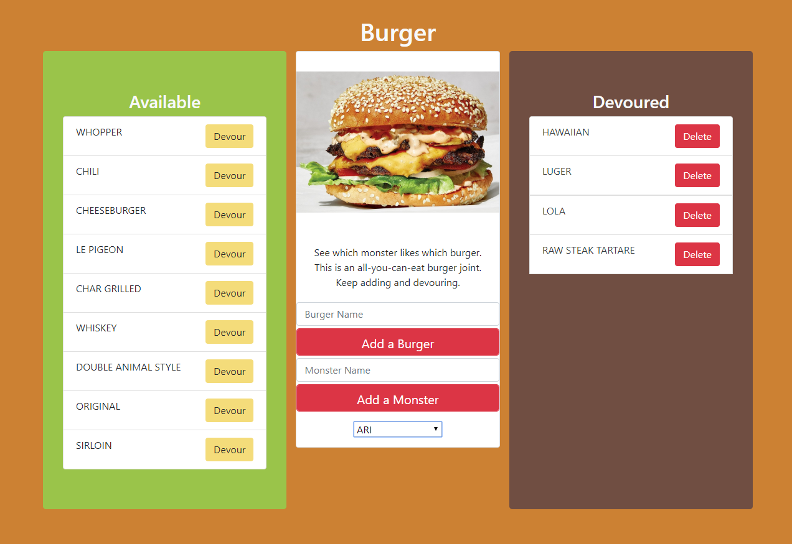

# Burger (Sequel)

### Overview

This is a burger app that I am creating to learn Sequelize.

* Customer model is associated to the burger model. The association is such that a customer has many burgers and a burger belongs to one customer. The app logs the name of customer along with the burgers that they ate.

* Handlebars are used to generate dynamic content from database and the Bootstrap CSS framework to style the page.

